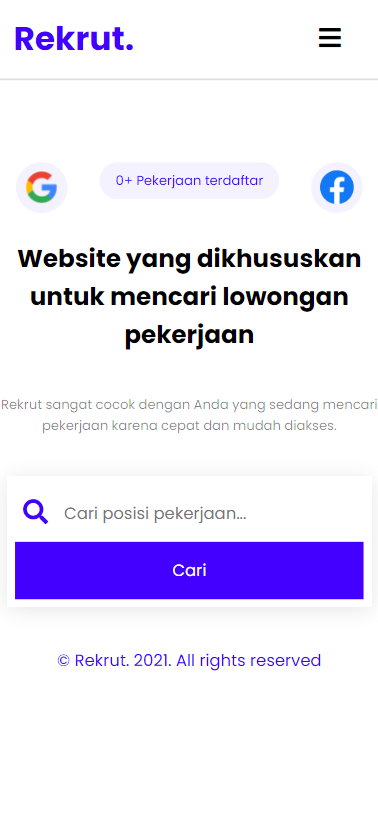
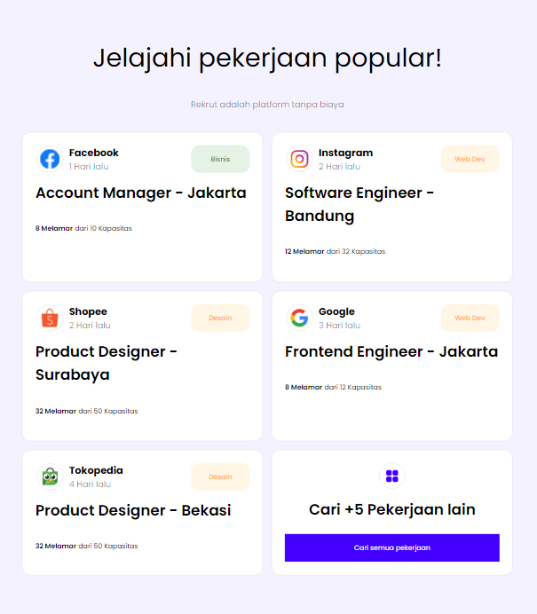
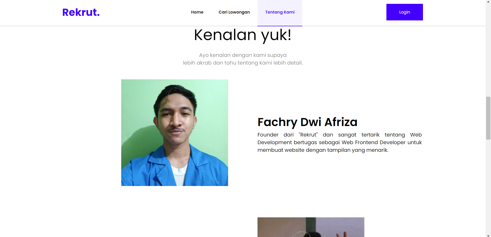
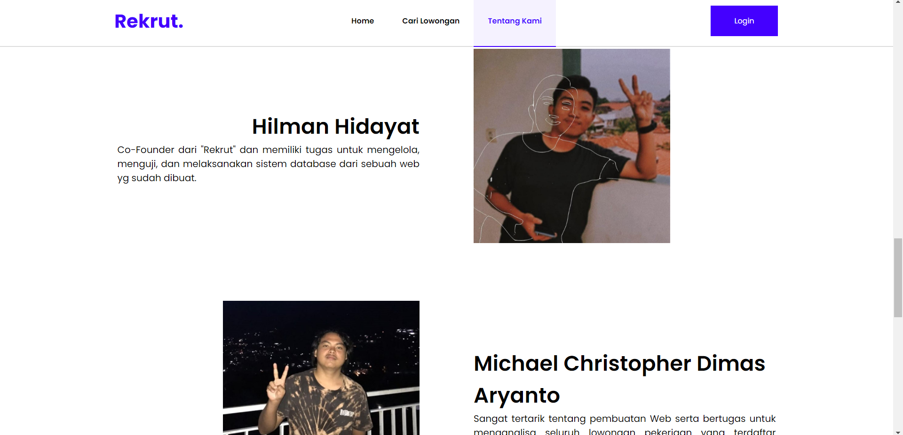
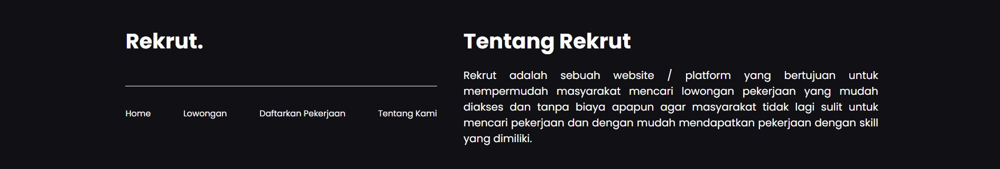
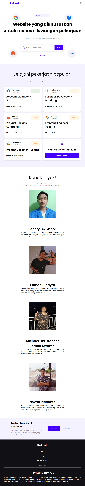

# Project Lowongan Pekerjaan "Rekrut"

Rekrut ini adalah project Web Programming tentang Lowongan Pekerjaan menggunakan HTML, CSS, Javascript dan PHP.

Website kami juga dapat diakses melalui link ini:
https://rekrut.netlify.app

Anggota kelompok:

- Fachry Dwi Afriza (19200277).
- Hilman Hidayat (19200274).
- Michael Christopher Dimas Aryanto (19200837).
- Novan Rizkianto (19200985).

Hasil dari tugas projectnya sebagai berikut:

1. Tampilan awal setelah halaman selesai loading:

   - Tampilan PC / Laptop
     

   - Tampilan Mobile

     

2. Bagian List Loker:

   - Tampilan untuk PC / Laptop
     

   - Tampilan Tablet
     
   - Tampilan Mobile

     

3. Bagian "Tentang Kami" atau kelompok:

   - Tampilan PC / Laptop
     
     

   - Tampilan Tablet
     

   - Tampilan Mobile

     

4. Bagian bawah halaman atau Footer:

   - Tampilan PC / Laptop
     

   - Tampilan Tablet & Mobile

     

5. Full tampilan Website "Rekrut"

   - Tampilan Full PC / Laptop
     

   - Tampilan Full Tablet
     

   - Tampilan Full Mobile

     
